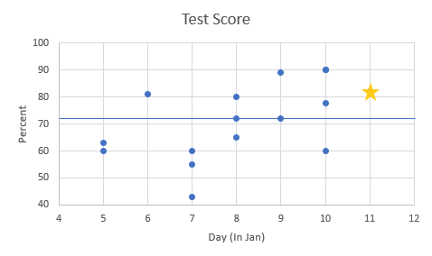

# AWS SysOps Exam

## Background

Before I closed out my SkillBridge, I wanted to get an AWS cert. I wasn't really sure which, but I knew the associate level ones would be good. I've heard the initial one is too easy, and the pro ones were definitely out of reach in the time I had. The description for it seemed like something I was interested to learn while I try and round out my knowledge of AWS outside of the more trivial single user features. 

> Preparing for and attaining this certification will showcase:
> * Your experience deploying, managing, and operating workloads on AWS as well as implementing security controls and compliance requirements
> * Familiarity with using both the AWS Management Console and the AWS Command Line Interface (CLI) 
> * Understanding of the AWS Well-Architected Framework as well as AWS networking and security services

As it turns out, at least according to a few random lists like [this one](https://www.linkedin.com/pulse/aws-certifications-difficulty-rankings-ramit-sharma/), this is commonly said to be the hardest associate level cert. I figured this out when I felt frustrated studying by how much there was to learn and got curious enough to look it up. 

## Studying

### Resources
There are a ton of resources for studying for these certs. There are a ton of additional notes on the relevant repo here that I won't copy but just summarize. See the repo for more: https://github.com/reberp/aws-soa-code

* Courses - I used Udemy courses (Neal Davis ones) since I have a subscription, but I'm sure there are others on other similar platforms. I didn't use the AWS course so I can't speak for how helpful it is. From a quick skim, it seems too light on content. 
* Practice Tests - The udemy courses had practice tests, as well as the AWS official practice material. 
* Study guides - [This list](https://digitalcloud.training/category/aws-cheat-sheets/aws-sysops-administrator-associate/) was pretty helpful for summarizing the different services you're required to understand, because there's a lot. Scrolling through this entire page even takes awhile. 



### Metrics
You can find these numbers in the github repo linked above, but I tracked the scores across practice tests.  
In total:  
* over 1000 practice questions
* 20 practice tests of varying length (mostly 65)
* ~69% average scores

If you're wondering what the hell happened on the 7th: apparently one course of practice tests is much harder than the other ones. It was on the 7th that I looked up how hard the associate tests were because I thought I made a mistake even trying. 

## Exam

Not much to say. Harder than I expected but I did better than I thought. 

