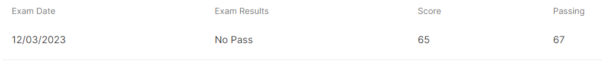
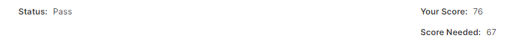

# CKS Exam

## Background

As part of my [SkillBridge](https://skillbridge.osd.mil/), I've had the unique opportunity to spend a more than usual amount of time on personal development. With the intent of trying to get myself into a DevOps engineering position after separating from the military, I need to do my best to demonstrate that I have the competencies necessary for the job. 

Outside of work before starting the SkillBridge, I passed the both the [Kubernetes and Cloud Native Associate (KCNA)](https://training.linuxfoundation.org/certification/kubernetes-cloud-native-associate/) exam and the [Certified Kubernetes Administrator (CKA)](https://training.linuxfoundation.org/certification/certified-kubernetes-administrator-cka/) exams, just to learn what I could before starting, on top of having gotten an intro in other jobs previously. After spending some time during SkillBridge learning additional CNCF tools, I wanted something else to show for the time I was spending, so I decided to try and get the [Certified Kubernetes Security Specialist (CKS)](https://training.linuxfoundation.org/certification/certified-kubernetes-security-specialist/) as well. 

## Studying

Probably everyone who's trying to learn DevOps, and especially the Kubernetes certifications, has heard of [KodeKloud](https://kodekloud.com) and Mumshad Mannambeth. Their courses are incredibly helpful for studying for these certifications, and the KodeKloud platform can be a helpful way to go about getting hands on with the tools, though building, and inevitably breaking and fixing, your own setup can be even more helpful at times. That was my approach for CKA. 

For CKS, the course I used was actually a different one, created by [Zeal Vora](https://digitalu.udemy.com/course/certified-kubernetes-security-specialist-certification/). I skimmed over the syllabus for this course and the Mumshad course, and found they were similar enough but the Zeal course seemed to have more explanation of the details throughout and I thought would benefit me more. I'm sure they are both sufficient. 

After spending ~2 weeks part time on the course, I moved on to the Killercoda scenarios. They give a good background to some simple scenarios that you should be able to intuitively understand as well as some more simple test-like questions. Some examples:
* APIServer crashed. Figure out why and fix it
* Update Falco to include a rule change
* Setup RBAC
* Ensure ETCD and all secrets are encrypted

After that is [Killer.sh](https://killer.sh/cks). This is the 'I think I'm ready for the test' point. As they say in their [FAQ](https://killer.sh/faq) 

> This simulator is more difficult than the real certification. We think this gives you a greater learning effect and also confidence to score in the real exam. Most of the simulator scenarios require good amount of work and can be considered "hard". In the real exam you will also face these "hard" scenarios, just less often. There are probably also fewer questions in the real exam.

I unfortunately didn't get numbers and time for how long I took on my first attempt, and the final score (see [Meta](#Meta)) . Still, I know it was MUCH longer than 2 hours and MUCH lower than a passing score. After finishing, their writeups on questions and answers and incredibly helpful to understand more complex topics related to the test. 

Then, it was time for the test. 

## Attempt 1

The header here raises the question of how many times I attempted, and if I even passed. 2, and yes, but I'll get to that. 

Since I don't know how detailed I can get on test content, I won't touch the topic. I'll just leave it to the experience I had. 

While I generally like performance-based tests, what I dislike about this series of LF tests is the time/question tradeoff. There are between 15-20 questions, and you have 2 hours to complete the exam. At most, that means an average of 8 minutes per question. During this time you have to:
* Read the question. Duh, but that can take time when they're multiple paragraphs or multiple steps of requirements.
* Understand the relationships. This can be between pieces of the question or pieces of the question and the current environment. 
* Orient to the environment. You have to understand what already exists in the environment, in the case you're supposed to tie into it or fix it. 
* Do the thing that the question asks.
* Confirm you did the thing right.
  
All of this can make the test feel more like an exercise in speed typing than engineering. It's quite common to see study guides recommend you set the following aliases first thing, as well as moving on from any question where you find yourself stuck for more than a few minutes. 
```
alias k=kubectl
export do=--dry-run=client -o yaml
export now=--grace-period 0 --force
```

All that complaining aside, the passing score is a 67%, so you're certainly not required to get every question correct. 

After completing the test, I was about 50% sure I had passed. Wouldn't have been surprised either way, though I sure hoped I passed. 



<h1 style="text-align: center;">Fuck!</h1>

## Attempt 2

That failure was *I think* the second test I've ever failed. And with a score that close, I can't let that stand. Have to do it again. 
Hit Killercoda and Killersh again over the next 5 or so days, re-learned the topics that I found I was unsure on, and took the test again. LF certs give you two attempts. 



## Meta
I've been meaning in the past to take better notes about what I did and when, and any quantifiables along the way. I don't have numbers for the killer.sh attempt, for example, or how long I spent on the course, or how much time I spent outside of the course doing experiments on my own. Makes it hard to write-up thoughts and progress toward goals or after obtaining them. This is especially true for previous certs that I spent a TON of time studying for. The next time I'm going to be different (he said, unjustifiably hopeful).
