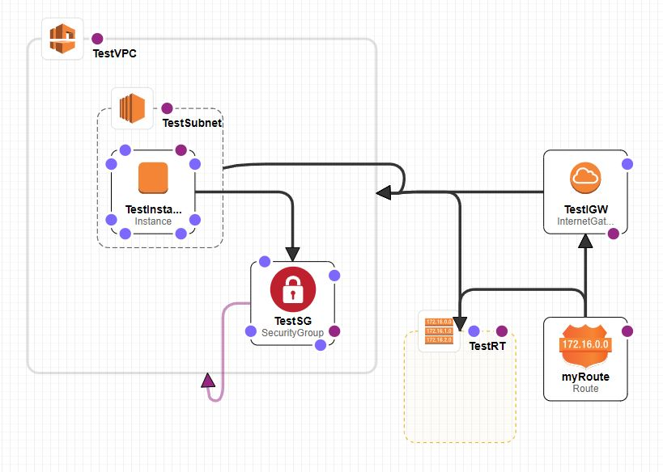

# Terraform and CloudFormation

## Background

In trying to study for the [AWS SysOps](https://aws.amazon.com/certification/certified-sysops-admin-associate) cert, I was trying to better learn [CloudFormation](https://aws.amazon.com/cloudformation/). 

In trying to better learn DevOps, I was trying to get more familiar with [Terraform](https://www.terraform.io/). 

The first half of the first sentence of the description for both of these is: "\<thing\> is an infrastructure as code tool/service" so they clearly fill a similar function. I just put together a simple example for each to get a an informal direct comparison of that example and how it would look on each of these tools. 

## The deployment

The simple deployment is to create an EC2 in a custom AWS environment with internet access and accessible from the internet. In order to that, you need to either:

* Use default network components (VPCs, etc). Not really ideal for an IaC solution. 
* Create your own. This is what we'll do.

### An IaC EC2 network

This is a simple set of components you can deploy to get an EC2 instance that meets the requirements above: 

* A VPC
* A subnet in the VPC
* An internet gateway attached to the VPC
* A route table attached to the VPC and associated to the subnet
* Routes that allow internet traffic
* A security group that allows internet traffic
* The instance

## The comparison

### The obvious tradeoff

The very immediate reason that someone would want to not use CloudFormation is because it's vendor locked. You can't use it anywhere else. 

Well as it turns out, as far as cloud providers go, I don't really know the other guys anyway, so that's fine for me. 

### CloudFormation

The CloudFormation template I used can be found here: https://github.com/reberp/AWS-automations/blob/d5d24fa6fd2ac92588959780461a80f4868ffa38/CloudFormation/ec2-network.yaml

One fun bit of CloudFormation (though it feels like a gimmick to me so far) is the designer. If you load this yaml into it, this is what pops out (after I reorganized it). 



Running it through the UI or CLI is easy enough. 

```
[cloudshell-user@ip-10-130-76-31 ~]$ aws cloudformation create-stack --stack-name TestStack --template-body file://ec2_network.yaml --parameters ParameterKey=KeyName,ParameterValue=desktop
{
    "StackId": "arn:aws:cloudformation:us-east-1:605214879020:stack/TestStack/fb7bb740-acf8-11ee-9cc4-0ae214eab9cb"
}
```

After that, we end up with our instances and can connect to them. 

Getting the outputs is kind of a pain since they each have to be specified in advance in the YAML from what I can tell. You can get them from the UI or CLI easy enough though, to use wherever afterwards. 

```
[cloudshell-user@ip-10-130-76-31 ~]$ aws cloudformation describe-stacks --stack-name TestStack --query "Stacks[*].Outputs[*].{OutputKey: OutputKey, OutputValue: OutputValue, Description: Description}"
[
    [
        {
            "OutputKey": "InstanceIP",
            "OutputValue": "54.224.71.52",
            "Description": "The IP of the instance"
        }
    ]
]
```

### Terraform

The Terraform files I used can be found here: https://github.com/reberp/AWS-automations/tree/e8c03dd37dc99c26e5ee8a59c4cad8b267f6e741/tf

Terraform definitely offers more in the way of error troubleshooting from what I saw in trying to get these to work, as well as planning and more machine-usable (if not as person friendly) I/O. 

A simple key export and a plan and run, and we have our nodes. 

```
pat@home:~/Desktop/AWS-automations/tf$ terraform apply

Terraform used the selected providers to generate the following execution plan.
Resource actions are indicated with the following symbols:
  + create

Terraform will perform the following actions:

...

instance_ips = [
  "3.88.85.171",
  "44.203.203.103",
]
instance_names = [
  "tf-test-create.0",
  "tf-test-create.1",
]
```

The flexibility of the I/O will be helpful since the intent here is that I want to actuate this with Ansible and then use Ansible to configure the nodes afterwards. 

## Any tool-exclusive features?

Each of these templates only uses a tiny fraction of the features of these tools, so I'm sure anyone who utilizes these to their fullest might have examples of things that only one of these tools can accomplish, but I haven't run into them yet (other than the obvious one mentioned at the start).

## The conclusion

There really isn't one. I just wanted to compare them. I have more to learn with Terraform for sure, but I anticipate that I will be more drawn to it except for simple deployments on AWS, or instances where the AWS tie-ins to CF (IAM RBAC for example if TF doesn't play nicely with it) are necessary. 