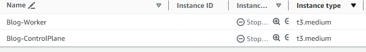

---
title: Hello World
date: 2024-01-01
description: First Post
image: hello-world.jpg
tags: 
    - GitOps
    - AWS
    - K8s
    - Hugo
categories:
    - Blogging
---
# Hello World

## The Where

[patrickreber.com](https://patrickreber.com)

If it's not up, it's because I have the node turned off. I actually have it set on an AWS [instance-scheduler](https://docs.aws.amazon.com/solutions/latest/instance-scheduler-on-aws/solution-overview.html) to not be up overnight and a few extra hours. Since this is going to be largely a means to experiment and I haven't moved it off of paid EC2 nodes (yet, see below), I don't think I'll pay for it all the time. 

## The Why
I've thought for a long time that I need a place to document things I've learned, I'm trying to learn, things I've done, thoughts about various pieces of life in and out of work. The ideal place certainly isn't 6-deep in a folder on my PC, though that's where it lived for a long time (and where most of it will definitely stay). 

While I don't think that things need to be necessarily perfect before being displayed for view, the act of putting together posts to address a topic of a subject requires some thought into arrangement, flow, scope, and a number of other factors that I think force you to solidify what the point of the post is, and helps expose any points of ongoing confusion that may have otherwise gone un-noticed. So here we are. 

In addition to that, since lately I'm exploring Kubernetes and various components of the cloud native ecosystem, this gives me one place where I can experiment with new things that I want to learn. 

## The How
Intending to use a statically hosted website, there's a ton of pretty simple ways to do it that would make it simpler to just write and display content. It could be anything from github pages, s3 static hosting, any number of cheap online nodes with a public IP, among others. Those just didn't seem as interesting since part of the intent is to give a place to do some experimenting, so I wen't with something unnecessarily complicated, although still simple enough to get up quickly. 

### Now: 
For now, this is how it exists. I expect to have separate short posts about a few pieces of this that were more interesting to dig into. 

* AWS EC2 nodes running a K8s cluster created with Kubeadm. Cluster is as basic as it gets, and I intend to explore more about the HA offerings that Kubeadm recommends
* Cloudflare hosted domain name patrickreber.com
* Cloudflared tunnel to access the Kubernetes service hosting the blog pods
* Static pod via Hugo
* Github actions to deploy a new static blog package, as well as an updated Kustomization manifest to ghcr
* Gitops deployment of new blog via Flux Kustomization and OCI Repository objects

### Later:
While I don't know what I'll change as I experiment with new tools that I want to learn, I think moving from AWS to a homelab is probably a good choice. Nobody realizes how much cloud computing costs until they start paying for it (there's another topic for discussion here about how easy it seems to dupe people when cost is presented on an hourly basis).

# The Future
Hopefully I continue to find interest in organizing and releasing thoughts and I continue to learn. I definitely could have put some thoughts done after short-term experiments with tools and frameworks, or after taking certain challenging certification tests in the past that typically garner write-ups (looking at you OffSec). Still, A few specific posts that I may put together: 
* Comparison of the setup on AWS for a blog cluster via EC2 'connect', CloudFormation, and Terraform/Ansible
* Notes on experimenting with cloudflared and Route53 hosted zone
* Notes on the current GitOps automation and why it's not really ideal and what I would like to do
* Issues with using cloudflared with ingress objects and certificate management that I still haven't figured out
